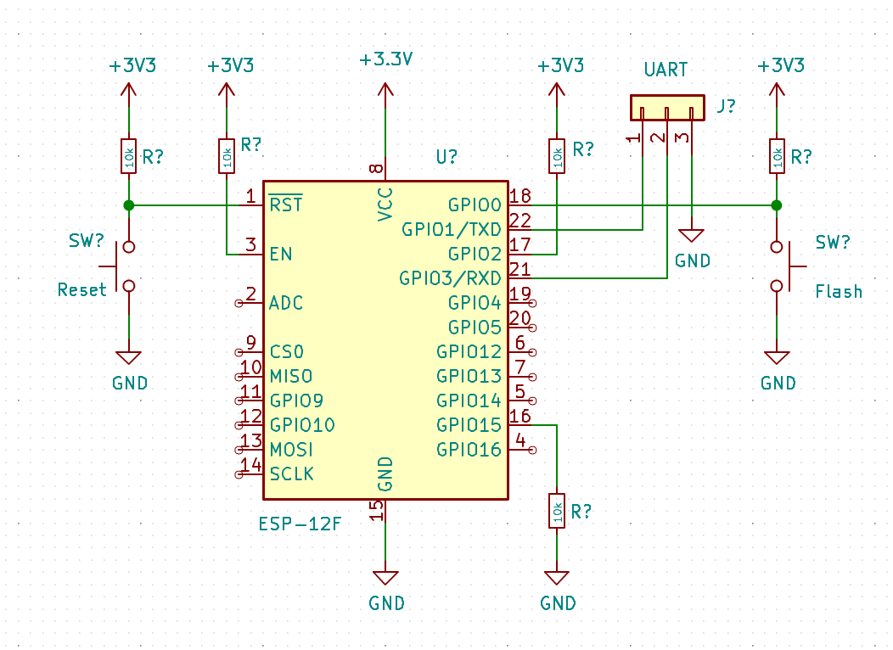

# Notes

These notes should work for both [WeMos Mini](https://wiki.wemos.cc/products:d1:d1_mini) boards
as well as for the following simple ESP12F circuitry suitable even for breadboard:



__However__ in the case of WeMos board there is no need to manually change RESET and GPIO0 levels and to use *before* and *after* parameters in *esptool*.
All the switching between running mode and programming mode will be done done using DTR/RTS of integrated USB-to-Serial chip.

## Using Minicom with original AI Thinker firmware

* Switch the board to running mode: set high level on GPIO0 pin
* Connect Minicom to device serial port with 115200 8N1 settings
* Enable carriage return using *CTRL-A U* control sequence
* Reset device: toggle low level on RST pin
```bash
Ai-Thinker Technology Co. Ltd.
ready
```
* Run AT commands pressing *Enter* and then *CTRL-J* after each command:
```bash
AT
OK

AT+GMR
AT version:0.60.0.0(Jan 29 2016 15:10:17)
SDK version:1.5.2(7eee54f4)
Ai-Thinker Technology Co. Ltd.
May  5 2016 17:30:30
OK
```

## Check device settings in programming mode

* Switch the board to programming mode: set low level on GPIO0 pin
* Reset the board: toggle low level on RST pin
* Run *esptool* to get chip parameters: reset chip between each command
```bash
$ sudo esptool.py --port /dev/ttyUSB0 --before no_reset_no_sync --after no_reset chip_id
esptool.py v2.6
Serial port /dev/ttyUSB0
Connecting...
Detecting chip type... ESP8266
Chip is ESP8266EX
Features: WiFi
MAC: 60:01:94:02:a9:f9
Uploading stub...
Running stub...
Stub running...
Chip ID: 0x0002a9f9
Staying in bootloader.
```

```bash
$ sudo esptool.py --port /dev/ttyUSB0 --before no_reset_no_sync --after no_reset read_mac
esptool.py v2.6
Serial port /dev/ttyUSB0
Connecting...
Detecting chip type... ESP8266
Chip is ESP8266EX
Features: WiFi
MAC: 60:01:94:02:a9:f9
Uploading stub...
Running stub...
Stub running...
MAC: 60:01:94:02:a9:f9
Staying in bootloader.
```

## Brief NodeMCU HOWTO
NodeMCU project provides an excellent [documentation](https://nodemcu.readthedocs.io), so no need to go into much details here. In brief, do the following steps to build and flash firmware image to WeMos D1 mini board:
* Get firmware source code
```bash
$ git clone https://github.com/nodemcu/nodemcu-firmware.git
```
* Customize NodeMCU firmware image
Edit _app/include/user_modules.h_
* Build firmware
Build NodeMCU firmware:
```bash
$ make
```
* Flash firmware
Switch device into programming mode and NodeMCU firmware
```bash
$ sudo ./tools/toolchains/esptool.py --port /dev/ttyUSB0 write_flash -fm dio -fs 32m 0x00000 bin/0x00000.bin 0x10000 bin/0x10000.bin
```

### How to copy Lua scripts to device spiffs

Using [luatool](https://github.com/4refr0nt/luatool):
```bash
$ sudo luatool.py --port /dev/ttyUSB0 --src test.lua --dest test.lua -b 115200
```

Using [nodemcu-tool](https://github.com/AndiDittrich/NodeMCU-Tool):
```bash
$ sudo nodemcu-tool upload init.lua
$ sudo nodemcu-tool upload test.lua -n main.lua
```

### How to create and flash spiffs image

Create image content list
```bash
$ cat script.img
import init.lua init.lua
import test.lua test.lua
import nrf24.lua nrf24.lua
```

Generate spiffs image
```bash
$ spiffsimg -f fs.img -S ${FLASH_SIZE} -U ${SPIFFS_SIZE} -r script.img
```

Flash spiffs image to device
```bash
$ sudo /home/matsi/bin/esptool.py --port /dev/ttyUSB0 write_flash -fm dio -fs ${FLASH_SIZE} ${SPIFFS_OFFSET} fs.img
```
